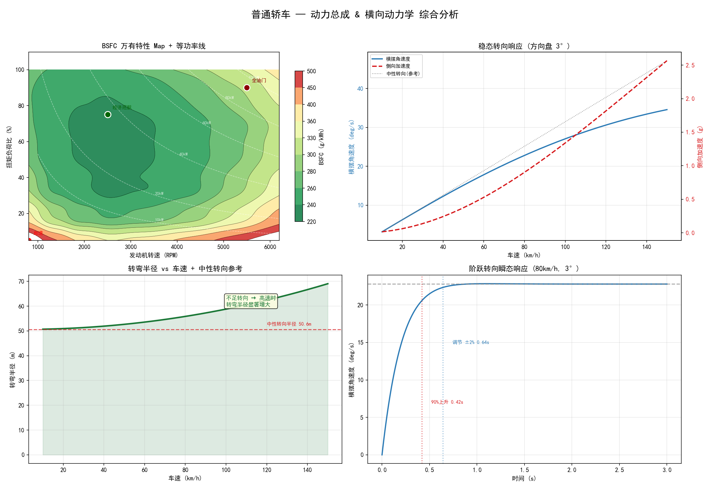
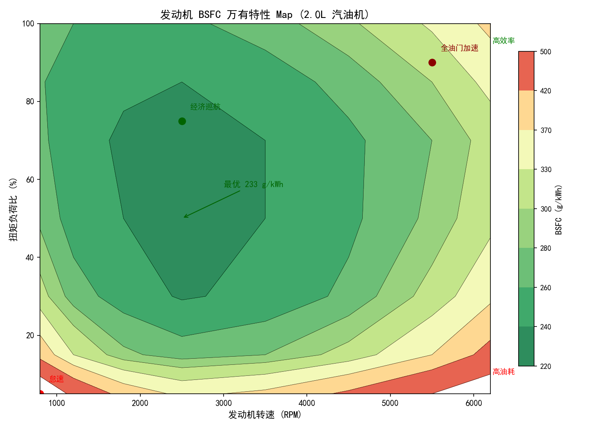

# Vehicle Physics Simulation

Python 车辆动力学仿真工具包。覆盖纵向动力学（加速/制动/油耗/功率分解）与横向动力学（自行车模型/不足转向/阶跃瞬态响应），84 条 pytest 测试。

## 项目结构

```
.
├── vehicle.py                  # Vehicle 类、行驶阻力、加速、制动、功率分解
├── lateral_dynamics.py         # 自行车模型、侧偏角、不足转向、阶跃转向瞬态
├── bsfc.py                     # BSFC 万有特性数据、双线性插值、油耗计算
├── wltc.py                     # WLTC Class 3 工况、瞬态油耗仿真
├── plotting.py                 # BSFC 热力图（三次样条 + contourf）
├── plot_dashboard.py           # 四合一汇总图（BSFC+稳态转向+半径+瞬态）
├── vehicle_dynamics.py         # 主入口：import 汇总 + __main__ runner
├── can_demo.py                 # CAN 总线仿真、DBC 生成、错误注入
├── test_vehicle_dynamics.py    # 车辆动力学 pytest 测试（84 条）
├── test_can_demo.py            # CAN 总线 pytest 测试
├── requirements.txt            # Python 依赖
└── README.md
```

## 模块

| 模块 | 文件 | 说明 |
|------|------|------|
| 车辆物理 | `vehicle.py` | Vehicle 类、行驶阻力、加速、制动、比功率 |
| 功率分解 | `vehicle.py` | 爬坡功率、风阻功率、比功率、动态滚动阻力(SAE J2263) |
| 横向动力学 | `lateral_dynamics.py` | 2-DOF 自行车模型、侧偏角、不足转向梯度、稳态/瞬态转向 |
| 油耗模型 | `bsfc.py` | BSFC Map（180 数据点）、双线性插值、L/100km |
| WLTC 工况 | `wltc.py` | Class 3 行驶工况（1800s）、瞬态油耗仿真 |
| 可视化 | `plotting.py`, `plot_dashboard.py` | BSFC 热力图、四合一汇总仪表盘 |
| CAN 总线 | `can_demo.py` | 5-ECU 报文生成、DBC/ASC 导出、总线负载、错误注入 |

## 功能

### 纵向动力学
- 车辆物理建模：动力总成参数、空气阻力（v²）、滚动阻力（常量和 SAE J2263 动态模型）
- 加速仿真：0-100 km/h 过程，基于 P=Fv 的驱动力模型
- 制动距离：反应距离 + 制动距离，不同路面摩擦系数
- 油耗计算：BSFC 双线性插值 + WLTC 瞬态仿真（含断油/加速加浓）
- 功率分解：滚动阻力功率、风阻功率（v³）、爬坡功率、比功率（W/kg）

### 横向动力学
- 2-DOF 自行车模型：侧偏角 αf/αr、横摆角速度 r、侧向速度 vy
- 不足转向梯度 Kus：前后轴载荷 + 侧偏刚度 → 不足/中性/过度转向分类
- 稳态转向响应：定方向盘转角下，横摆角速度、侧向加速度、转弯半径 vs 车速
- 阶跃转向瞬态：欧拉积分仿真，90% 上升时间

### CAN 总线仿真
- 5 个模拟 ECU：EMS、BMS、ABS、TCU、BCM
- 自动生成 DBC 文件 + ASC 日志
- 总线负载监控 + 错误帧注入 + DTC 故障扫描

## 快速开始

### 环境
- Python 3.8+
- 依赖见 `requirements.txt`

### 安装

```bash
git clone https://github.com/Young-skyyy/vehicle-physics-sim.git
cd vehicle-physics-sim
pip install -r requirements.txt
```

### 运行

```bash
# 车辆动力学：加速、制动、油耗、功率分解、横向转向
python vehicle_dynamics.py

# CAN 总线仿真：ECU 报文、DBC 生成、ASC 日志
python can_demo.py

# 仪表盘汇总图
python plot_dashboard.py
```

### 输出

运行 `vehicle_dynamics.py` 输出：
- 加速曲线（0-100 km/h）
- 制动距离对照表
- 三车型油耗对比（L/100km）
- 功率分解（常量 vs SAE J2263 动态滚动阻力）
- 横向动力学分析（不足转向梯度、稳态转向、阶跃瞬态响应）
- BSFC 热力图（`bsfc_map.png`）
- 四合一汇总仪表盘（`dashboard_*.png`）

## 可视化

### 四合一汇总仪表盘


*BSFC 万有特性 / 稳态转向响应 / 转弯半径 vs 车速 / 阶跃转向瞬态响应*

### BSFC 万有特性 Map


*双线性插值等高线，颜色越深效率越高*

## 测试

[](https://github.com/Young-skyyy/vehicle-physics-sim/actions/workflows/test.yml)

84 条单元测试，覆盖核心函数。本地运行：

```bash
pip install pytest
python -m pytest test_vehicle_dynamics.py test_can_demo.py -v
```

**测试覆盖：**
- `Vehicle` 类：初始化、档位选择、横向参数默认值
- `calc_resistance`：滚动+风阻公式、动态/常量滚动阻力对比
- `calc_braking_distance`：反应+制动物理、湿/干路面
- `_interpolate_bsfc`：双线性插值、边界钳位、柴油 vs 汽油
- `_calc_l100_raw`：各车速巡航油耗
- `get_wltc_profile`：WLTC Class 3 数据完整性（1801 数据点）
- 功率函数：爬坡功率、比功率、风阻功率（v³ 关系）
- 横向动力学：侧偏角、不足转向梯度、特征/临界车速、稳态转向、阶跃瞬态收敛
- CAN 信号：编解码、DBC 生成、ECU 状态机

## 关键技术

- **BSFC 双线性插值**：在发动机万有特性图上查找瞬时油耗
- **SAE J2263 滑行阻力模型**：f₀ + f₁v + f₄v⁴ 动态滚动阻力系数
- **2-DOF 自行车模型**：侧偏角 → 侧向力 → 横摆力矩 → 状态空间欧拉积分
- **不足转向梯度**：Kus = Wf/Cf - Wr/Cr，区分不足/中性/过度转向
- **CAN 帧编解码**：11-bit 仲裁域、Intel/Motorola 字节序、8 字节载荷信号打包

## License

仅供学习和作品展示。
